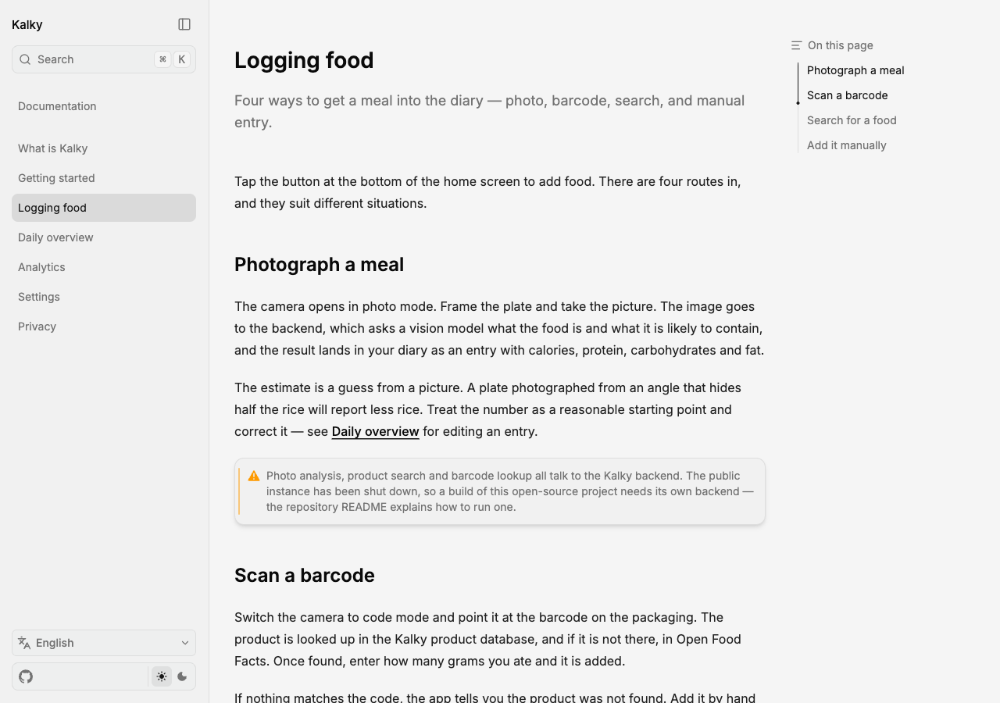

<div align="center">

# Kalky

**AI-powered food & nutrition tracking for the Czech market.**

[](https://github.com/Empatixx/kalky/actions/workflows/android.yml)
[](https://github.com/Empatixx/kalky/actions/workflows/ios.yml)
[](https://github.com/Empatixx/kalky/actions/workflows/backend.yml)
[](https://kotlinlang.org/docs/multiplatform.html)
[](https://www.jetbrains.com/compose-multiplatform/)



</div>

Kalky is a Czech-language food and nutrition tracker. Photograph a meal and a vision model estimates calories and macros, scan a barcode against a Czech product database (falling back to Open Food Facts), search by name, or add a food by hand — every route lands the same structured entry in your diary.

- **One shared codebase** — every screen, ViewModel, repository, network client, and database in the app lives in a Kotlin Multiplatform module. Android and iOS render the exact same Compose UI; the platform shells only wire up camera, auth, and OS integrations.
- **AI-first logging** — a small self-hosted backend turns a food photo into a nutrition estimate via an OpenAI vision model.
- **Own product data** — a Czech full-text product database with barcode lookup, backed by Open Food Facts as a fallback.
- **iOS-inspired design** — a custom component set (`KalkyButton`, `KalkyCard`, `KalkySegmentedControl`, ...) instead of stock Material widgets.

## Get Started

### Android
Requires JDK 21 and Android Studio.
```bash
./gradlew :app:installDebug
```
Ships pointed at the deployed backend by default, so a local backend isn't needed just to run the app.

### iOS
Requires macOS and Xcode. Link the shared framework, then open the Xcode project.
```bash
./gradlew :shared:linkDebugFrameworkIosSimulatorArm64
open iosApp/Kalky.xcodeproj
```

### Backend
Only needed if you're changing the API. Requires [Bun](https://bun.sh/) 1.0+.
```bash
cd backend
bun install
cp .env.example .env   # fill in OPENAI_API_KEY, ADMIN_KEY, Firebase service account
bun run dev             # http://localhost:3000
```

Full setup, Remote Config wiring for a local backend, and troubleshooting live in [docs/RUNNING_THE_APP.md](docs/RUNNING_THE_APP.md).

## Features

- **Four ways to log a meal** — photo analysis, barcode scan, text search, manual entry.
- **Analytics** — daily/weekly macro trends and logging streaks.
- **Custom foods & nutrient editing** — save your own entries and correct AI estimates.
- **Google & Apple sign-in** — Firebase Auth, with idempotent user registration on the backend.
- **iOS Live Activities & widgets** — track a food-photo analysis in the Dynamic Island and add a home-screen widget.
- **Deep links** — jump straight to a logged food entry from a notification or widget.
- **Onboarding** — guided first-run setup for profile and goals.

## Tech Stack

| Layer | Technology |
|---|---|
| UI | Compose Multiplatform + Material3, custom Kalky component library |
| Architecture | MVVM, Koin dependency injection |
| Database | SQLDelight (multiplatform) |
| Networking | Ktor + kotlinx-serialization |
| Auth | Firebase Auth (Google / Apple) |
| Date/Time | kotlinx-datetime |
| Backend | Bun + SQLite, raw `Bun.serve`, FTS5 full-text search |
| AI | OpenAI vision model for food-photo analysis |

## Project Structure

```
shared/    Kotlin Multiplatform module — all UI, ViewModels, repos, network, DB, DI, navigation
app/       Android shell — MainActivity, CameraX, ML Kit barcode scanning, Firebase
iosApp/    SwiftUI entry point, AVFoundation camera, Live Activities, WidgetKit extension
backend/   Bun + SQLite API — photo analysis, barcode lookup, product search, auth
```

`shared` is platform-independent — Firebase, CameraX, and AVFoundation stay out of it. Platform modules implement the interfaces it defines (`PlatformActions`, `AuthTokenProvider`, `ImageStorage`, ...).

<details>
<summary><strong>Roadmap / feature ideas</strong></summary>

### Meal Planning & Recipes
- **Meal Templates** - Save frequently eaten meals as templates for quick re-logging
- **Recipe Builder** - Combine multiple ingredients into a recipe with total nutrition
- **Meal Plans** - Create weekly meal plans with automatic shopping lists
- **Favorite Foods** - Star foods to quickly find and re-add them

### Smart Recommendations
- **AI Meal Suggestions** - Based on remaining daily macros, suggest what to eat next
- **Deficit/Surplus Alerts** - Notify when significantly under or over daily targets
- **Macro Balancing** - Suggest foods that would balance remaining macros optimally
- **Personalized Goals** - Auto-calculate calorie targets based on profile (BMR/TDEE)

### Social & Sharing
- **Progress Sharing** - Export weekly/monthly nutrition summaries as images
- **Food Diary Export** - PDF/CSV export of food logs
- **Streak Tracking** - Track consecutive days of logging
- **Achievements** - Badges for hitting macro targets, logging streaks, weight goals

### Advanced Analytics
- **Trend Analysis** - Weekly/monthly averages with trend arrows
- **Goal Progress** - Weight loss/gain progress toward a target weight
- **Nutrient Breakdown** - Detailed micronutrient tracking (fiber, sodium, sugar, vitamins)
- **Correlation Insights** - Show how macro changes correlate with weight changes
- **Calendar Heatmap** - Color-coded calendar showing which days hit targets

### Food Database
- **Manual Entry** - Add foods by typing name and nutrition manually
- **Search** - Search Open Food Facts database without scanning barcode
- **Custom Foods** - Create and save custom food entries
- **Recent Foods** - Quick-add from recently logged items
- **Food History** - Browse all previously logged foods with search/filter

### Health Integrations
- **Google Fit / Apple Health** - Sync weight, steps, exercise calories
- **Water Tracking** - Daily water intake with reminders
- **Exercise Logging** - Log workouts and adjust calorie budget
- **Sleep Tracking** - Correlate sleep quality with nutrition

### UX Improvements
- **Quick Add Widget** - Home screen widget for fast food logging
- **Notifications** - Meal reminders, daily summary, goal alerts
- **Offline Mode** - Queue AI analysis requests when offline
- **Multi-language** - English, Slovak, and other language support

### Technical
- **Cloud Sync** - Sync data across devices via backend
- **Image Gallery** - Pick food photos from gallery instead of only camera

</details>
