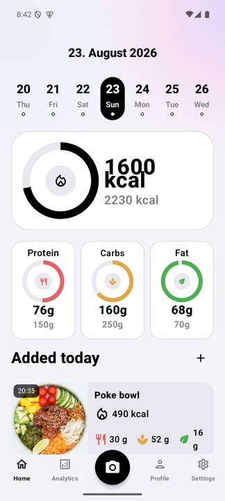
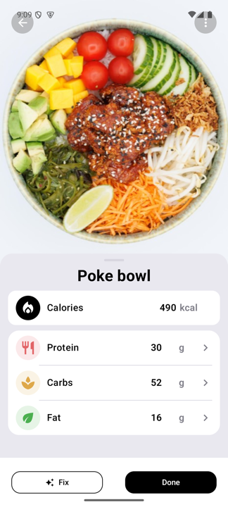
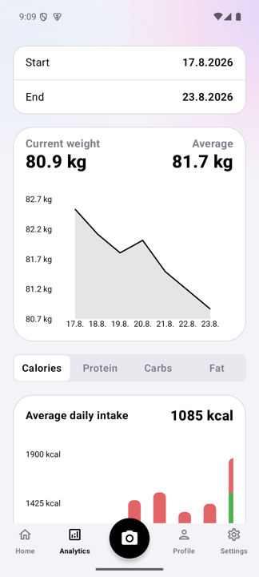

<div align="center">

# Kalky

**AI-powered food & nutrition tracking, in Czech.**

[](https://github.com/Empatixx/kalky/actions/workflows/android.yml)
[](https://github.com/Empatixx/kalky/actions/workflows/ios.yml)
[](https://github.com/Empatixx/kalky/actions/workflows/backend.yml)
[](https://empatixx.github.io/kalky/)
[](LICENSE)



</div>

A food and nutrition tracking app for Android and iOS, built with Kotlin Multiplatform and
Compose Multiplatform. Log meals by photo (AI nutrition analysis), by barcode, or by search,
and track calories and macros over time.

The UI language is Czech. Full docs, including the guide these screenshots are pulled from,
live at **[empatixx.github.io/kalky](https://empatixx.github.io/kalky/)**.

## How it works

Point the camera at a plate and the app sends the photo to its backend, which asks an OpenAI
vision model to estimate the nutrition. Packaged food can be added by scanning a barcode, which
is looked up in the app's own product database with Open Food Facts as a fallback. Everything is
stored locally in SQLite and shown as daily totals, streaks, and trends.

## Project layout

Nearly all the code is shared. The platform modules are deliberately thin.

| Path | What lives there |
|---|---|
| `shared/src/commonMain` | All Compose UI, ViewModels, repositories, networking, database, DI, navigation, theming, i18n |
| `shared/src/iosMain` | iOS implementations of the shared platform interfaces |
| `app/` | Android shell — `MainActivity`, CameraX capture, ML Kit barcode scanning, Firebase |
| `iosApp/` | SwiftUI entry point, `ComposeUIViewController` wrapper, AVFoundation camera, widgets |
| `backend/` | Bun + Prisma + SQLite server: image analysis, barcode lookup, product search |

Platform-specific work is reached through interfaces declared in `commonMain`
(`PlatformActions`, `AuthTokenProvider`, `ImageStorage`, `AppPreferences`) and implemented per
platform. Firebase, CameraX, and AVFoundation never appear in `commonMain`.

## Stack


Kotlin 2.2 · Compose Multiplatform 1.8 · Koin · SQLDelight · Ktor 3.2 · kotlinx-serialization ·
kotlinx-datetime · multiplatform-settings · Firebase Auth · Material3

## Running it

Kalky is not a turnkey clone-and-run project. It expects three things you have to provide
yourself: a Firebase project, a backend, and an OpenAI API key. **The backend that the public
builds pointed at is no longer running**, so a fork must host its own.

### 1. Prerequisites

- **JDK 21.** Newer JDKs are not compatible with the Android Gradle Plugin version in use.
- Android Studio (or just the Android SDK) for the Android app.
- Xcode and [XcodeGen](https://github.com/yonaskolb/XcodeGen) for the iOS app.
- [Bun](https://bun.sh) for the backend.

### 2. Firebase

Create your own Firebase project and enable **Authentication** (Google and Apple sign-in).
Then add an Android app with package name `cz.krokviak.kalky` and an iOS app with the same
bundle ID, and download the config files:

```sh
cp app/google-services.json.example app/google-services.json
cp iosApp/iosApp/GoogleService-Info.plist.example iosApp/iosApp/GoogleService-Info.plist
```

Replace both with the real files from the Firebase console. They are gitignored, so they will
not be committed. The `.example` files exist only so the Gradle build and CI have something
structurally valid to work with — an app built against them will compile but will not sign in.

### 3. Backend

```sh
cd backend
bun install
cp .env.example .env      # fill in OPENAI_API_KEY and a random ADMIN_KEY
bun run prisma:migrate:dev
bun run src/index.ts      # listens on :3000
```

`GOOGLE_APPLICATION_CREDENTIALS` must point at a Firebase service account JSON for the same
project — the backend uses it to verify the ID tokens the app sends.

### 4. Point the app at your backend

The backend URL is currently a compile-time default in four places, overridable at runtime via
Firebase Remote Config (key `backend_base_url`):

- `shared/src/commonMain/.../core/network/FoodAnalysisClient.kt`
- `app/src/main/java/.../config/RemoteConfigManager.kt`
- `app/src/main/java/.../core/notifications/KalkyFcmService.kt`
- `iosApp/iosApp/Auth/IosRemoteConfigManager.swift`

Use HTTPS. The app attaches a Firebase ID token to every backend request, and over plain HTTP
those tokens travel in cleartext.

### 5. Build

```sh
./gradlew :shared:compileDebugKotlinAndroid   # shared module, Android target
./gradlew :app:assembleDebug                  # Android app
./gradlew :app:testDebugUnitTest              # unit tests

./gradlew :shared:compileKotlinIosSimulatorArm64        # shared module, iOS target (macOS only)
./gradlew :shared:linkDebugFrameworkIosSimulatorArm64   # iOS framework
cd iosApp && xcodegen generate                          # then open Kalky.xcodeproj
```

The Xcode project is generated from `iosApp/project.yml`; edit that rather than the `.xcodeproj`,
which is gitignored.

## API

| Endpoint | Purpose |
|---|---|
| `POST /cal` | Food image analysis — raw image bytes in, nutrition JSON out |
| `GET /api/barcode/:code` | Product lookup by barcode |
| `GET /api/search?q=` | Product text search, max 20 results |
| `POST /api/auth/me` | Idempotent user registration and lookup |
| `POST /api/admin/import` | Bulk product import, requires `ADMIN_KEY` |

All except the admin route require a Firebase ID token in the `Authorization` header.

## Contributing

Issues and pull requests are welcome. Two conventions worth knowing before you start:

- **`commonMain` stays platform-independent.** If you need a platform SDK, declare an interface
  in `commonMain` and implement it in `app/`, `iosMain/`, or `iosApp/`.
- **Business logic keeps one level of nesting.** ViewModels, repositories, use cases, and
  utilities use guard clauses, extracted helpers, and `when` chains rather than stacked
  conditionals. Composables are exempt — Compose's layout DSL is structural, not control flow.

`CLAUDE.md` documents the architecture in more detail. Planned features are in
[docs/ROADMAP.md](docs/ROADMAP.md).

## License

MIT — see [LICENSE](LICENSE). Use it, fork it, ship it; just keep the copyright notice.
